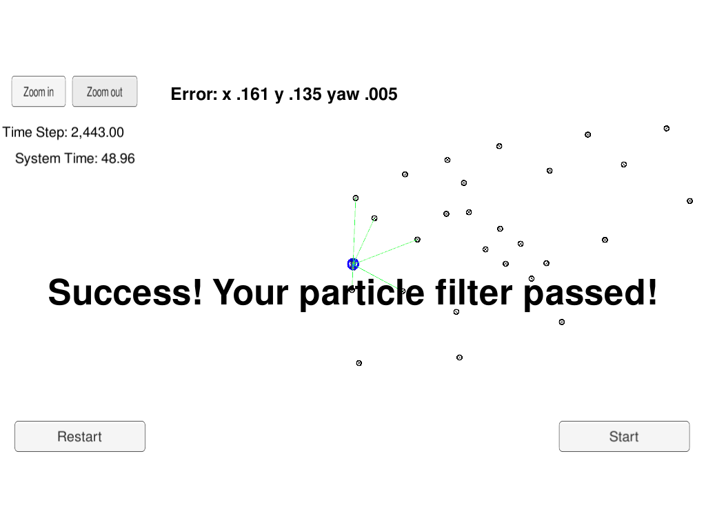

# Particle Filter

## About Particle Filters

The filtering problem tries to estimate the state of a dynamical system when partial observations are made and the sensors have random perturbations. To solve this problem in some "best" way, filters implement a prediction and update steps. This steps use Monte Carlo (MC) principles, genetic algorithms and Markov processes to compute the posterior.

#### Monte Carlo

Particle filters keep multiple particles in memory to approximate the filtering density; this approach is called Monte Carlo (MC), in which we compute N different particles.

#### Genetic Algorithms
Not all this particles "survive" during the update step. Depending on a fitness function, we select which particles survive the next iteration with a probability proportional to the fitness function. In this problem, we consider as fitness function the probability that all the measurements from the vehicle correspond with locations of the different landmarks of the world. We model this probability as a gaussian distribution (using as mean the difference between the sensor-readings of the landmark and for the covariance matrix the sensor errors, as independent).

#### Markov processes
Particle filters use a random generation of samples during the prediction step, adding some random value to the next state of the dynamical system. Since the next state depends only on the previous state, we model this problem as a Markov process.

## Compiling and executing the project

- Clone the repo and cd to it on a Terminal.
- Create the build directory: `mkdir build`.
- `cd build`
- `cmake ..`
- `make`: This will create the executable `particle_filter`, that contains a particle filter implementation implementation.

`particl_filter` communicates with a Udacity simulator that reads the input data and produces estimations for the object. See [Udacity's seed project](https://github.com/udacity/CarND-Kidnapped-Vehicle-Project) for more information on how to install the simulator.

Open the simulator and run `./project-filter` to enable the connection. Select Project 3 from the simulator.

## Implementation

The project simulates the movement of a vehicle around a world. The sensors of the vehicle are not precise (have random perturbations) so the exact locations of the landmarks detected by the vehicles is not precise. For every iteration we compute how likely each particle is to have sensed all the landmarks given its current internal state and observations made. Then, using this probability as weights (the higher, the more likely the particle is correct) and we resample, keeping more frequently (statistically) the more likely particles. 

For the implementation, I wrote a few helper methods (some of which I would separate from the ParticleFilter class). The basic methods are:

- init: initializes the particles, using sampling from a gaussian distribution around the starting point and orientation angle of the particle in the space.

- prediction: moves the particle to the next position given the previous velocity and yaw rate (orientation angle speed). As mentioned before, we add some gaussian noise to the measurements (MC). I added a more precise computation when the particles are not moving straight, but this did not affect much the results of the simulator.

- updateWeights: compute the new weights that will be used to sample the particles that will survive the current iteration. The weight is considered as the join probability of all landmark measurements being close to the real measurements.

- resample: using wheel sampling, we select which particles are surviving for the next iteration.

## Results

I implemented the filter with 10 and 100 particles. There were not big differences between them, even though using 100 particles improved the results (from an error of {0.161, 0.135, 0.005} in x, y and yaw to an error of {0.127, 0.126, 0.004}.  The time it took to finish the task was similar (48.88s). Even increasing the number of particles to 1000 can still keep up with the simulator (even though there are no performance improvements).

